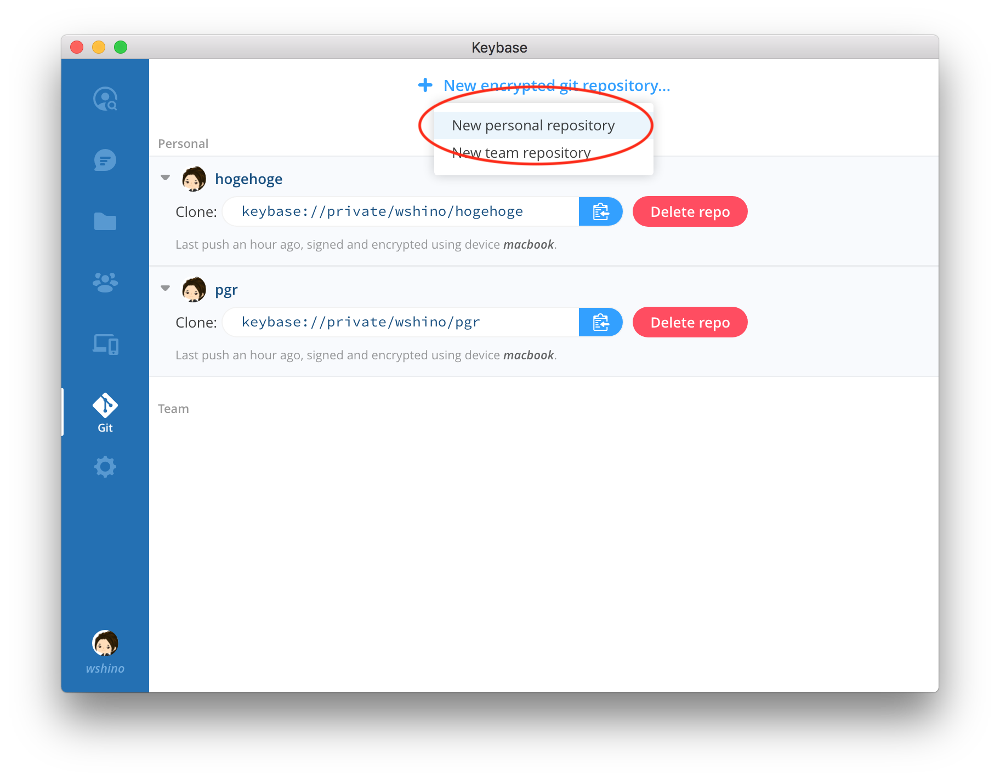
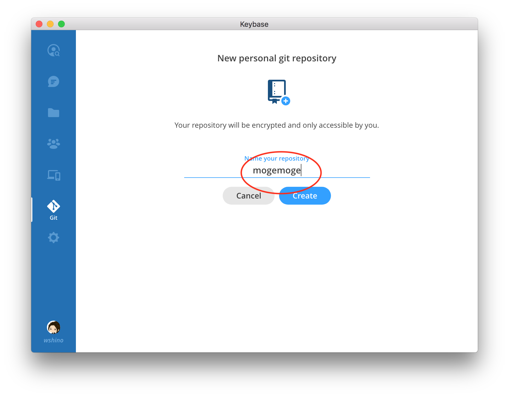
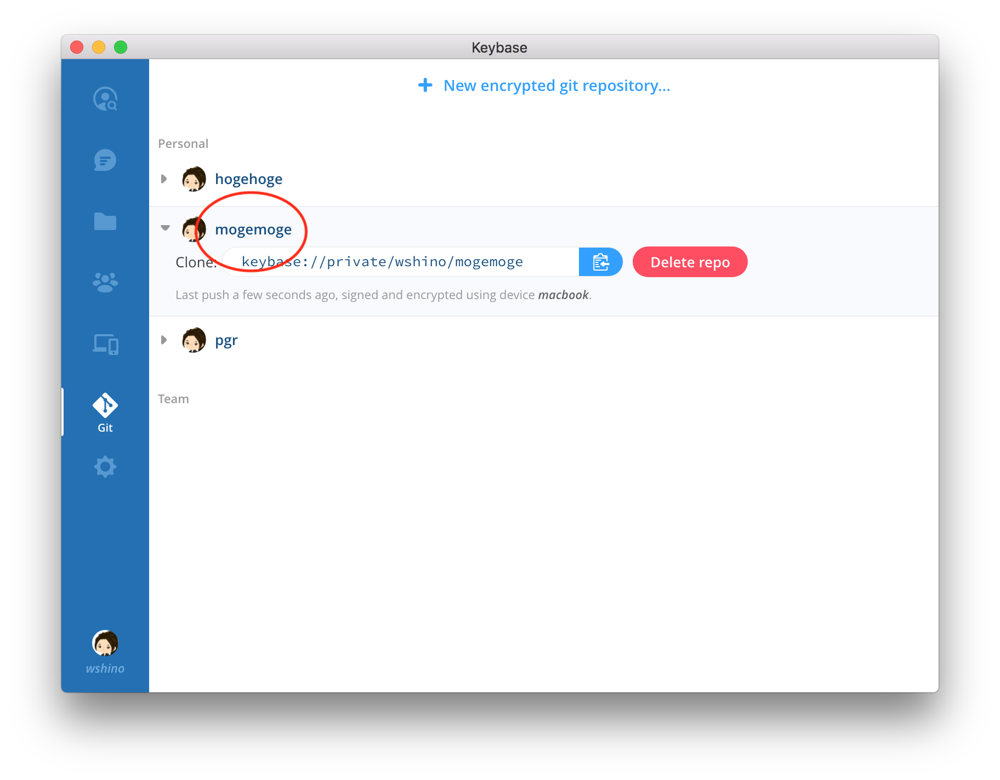
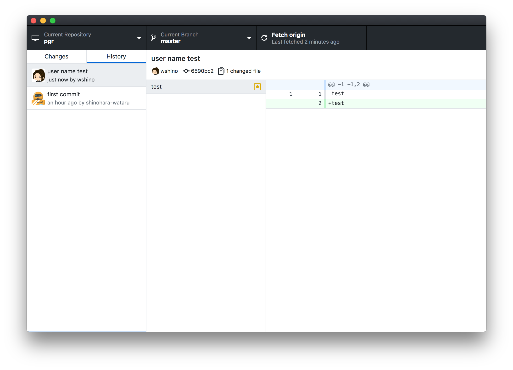
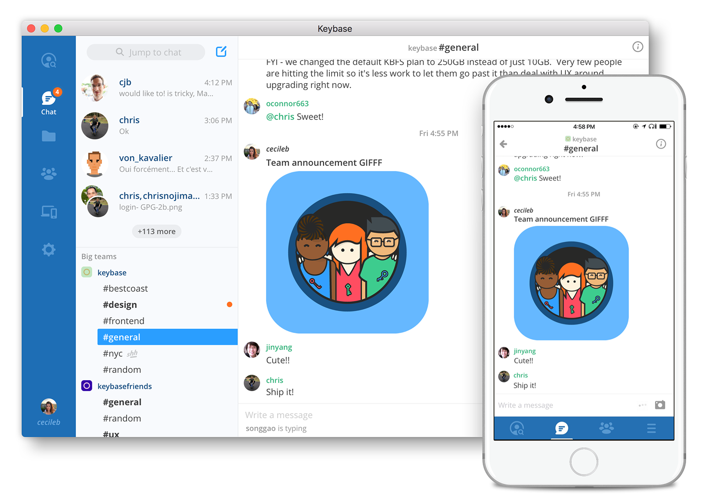

Keybaseを使って暗号化 git repositoryを作ろう

---

### private repository
### 欲しいときありますね

- 発表前の研究
- 小説
- プライベートファイル or プロジェクト
- APIキー
- シークレット
- ビジネスドキュメント

---

## Keybaseを使おう

> 先日、公開鍵基盤のKeybaseがencrypted gitをローンチしました


> Keybaseアプリを使うと完全に暗号化されたprivate repositoryを作ることができます。

---

## Keybaseの登録方法

### https://keybase.io/download

私は[gist](https://gist.github.com/wshino/2044b1ac283be26d908f19c8c9447ec5)で登録しました

---

## encrypted git の作り方

### personal repositoryを選ぶ

<!-- .element height="60%" width="60%" -->

---

## encrypted git の作り方

### repository名を入力する

<!-- .element height="60%" width="60%" -->

---

## encrypted git の作り方

### repository登録完了

<!-- .element height="60%" width="60%" -->

---

## encrypted git の作り方

### git clone

```bash
git clone keybase://private/wshino/mogemoge
```

---

## encrypted git

- 認証がとれたデバイスでしか利用できません
- エンドツーエンドで暗号化されています
- リポジトリ名やブランチ名も暗号化されています。
- pushしたデータはデバイスが持つ秘密鍵で署名されます

---

## 今はGUIがない

GUIが欲しい人は好きなクライアントを使おう

- Github Desktop
- SourceTree
- IntelliJ

---

<!-- .element height="70%" width="70%" -->

---

## to encrypted


```
# 1. make the encrypted remote repo
keybase git create sbt-rpm
# 2. get your old stuff into a temp directory
git clone --mirror \ 
https://github.com/wshino/sbt-rpm _tmp.git
# 3. head north of the wall
cd _tmp.git
# 4. push onward, to Craster's keep
git push --mirror keybase://private/wshino/sbt-rpm
# 5. back to Winterfell; kill some boltons
cd .. && rm -rf _tmp.git
# 6. DONE. You can clone anywhere and find this repo in the Keybase app
git clone keybase://private/wshino/sbt-rpm
```

---

###  Keybaseにはチャットツールが付いているので議論は便利かも

<!-- .element height="70%" width="70%" -->

---

## その他

- 容量のリミットは100GB
- チームごとにも100GB
- commitに署名はしていない